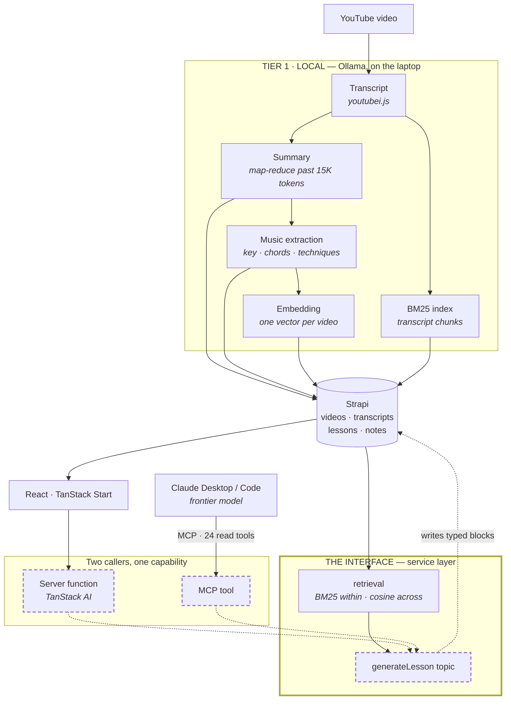

# Don't Build the AI Feature, Build the Interface

**React, TanStack AI, and MCP**
**React Summit · 7 min lightning · ~October 2026**
*Placeholder. Details get filled in as the app gets built.*

---

## Spine

> Local-first was supposed to be the compromise version. TanStack AI made
> streaming and tool calls cheap enough that it wasn't. And because those
> capabilities ended up exposed as **tools** rather than buried inside a
> feature, aiming a frontier model at the whole library over MCP cost almost
> no new code.

Local for the routine work, frontier for the creative work, the same surface
underneath both. The title's claim is the mechanism: build the interface and
you get more than the feature you set out to build.

## The opening joke

Open on a slide reading **"How TanStack AI Saved My Music Career."**

> "This is what I wanted to call this talk."
> *(beat)*
> "It didn't. I still can't play."
> *(play something badly for six seconds)*
> "But something more interesting happened than me getting good."

Then the real title card. Gets the laugh, buys the credibility, and keeps the
bad playing — which is the best fifteen seconds in the talk.

## Architecture — where we're going

Solid = built today. **Dashed = still to build**, and it's exactly the talk's
demo path.

**Reading it for the talk:** the left-to-right story is that everything in
TIER 1 is routine work a local model handles fine, and it all lands in one
place. `generateLesson` is the only genuinely creative step — and it sits
behind an interface, so the in-app button and Claude reach it identically. The
frontier model isn't wired into the app; it's a caller, like anything else.

Two retrieval layers, on purpose: **BM25** within a video (one transcript fits
in one context — vectors would be overhead), **embeddings** across videos (one
per video, in-memory cosine, no vector DB).

## Outline

| Time | Beat |
|---|---|
| 0:45 | Joke title, bad playing, real title. |
| 1:00 | The tempting version: a Generate Lesson button, a prompt, a model. Why that ages badly. |
| 1:15 | Tier 1 — local, background, boring on purpose: transcript, summary, extraction, embedding. |
| 1:30 | **TanStack AI on screen.** `chat()`, a server-side tool, streaming into React. How little there is. |
| 1:15 | The pivot: one `generateLesson()` service, two callers. The MCP one cost almost nothing because it was already an API. |
| 1:00 | Demo: the same lesson generated from the app, then from Claude. Identical output, different tier. |
| 0:15 | "Build the interface. The feature is the easy part." Out. |

**Where TanStack AI earns its place** — say it explicitly at the code beat: one
abstraction over two very different backends, tools as typed server functions,
streaming as the default. If only one lands, make it the first.

## Build list

The demo is two callers producing the same thing. **Build it once:**

- [ ] `generateLesson(topic)` service — retrieve related videos, emit blocks.
      Lives in `client/src/lib/services/`. This IS the interface the talk is about.
- [ ] Server-function entry point + in-app UI
- [ ] MCP lesson tools (create/update, list, get). Read side is done — 24 tools
      — but no lesson tools exist, so today a human bridges the loop with the
      seed script.
- [ ] `status` filtering or badging — `draft` / `published` / `ai-generated` is
      stored but never used, so generated drafts look like reviewed work. Matters
      more once a button can produce them.
- [ ] A worked example in the generator's context — one real lesson teaches how
      blocks combine in a way the schema alone can't.
- [ ] More lessons in the library, so "search the corpus" has a corpus.
- [ ] **MCP scoping.** Tiers exist in `catalog.ts` (`read` 16 / `write` 4 /
      `maintenance` 4) but nothing gates which are *exposed*. Want config for
      which tiers a client can reach, and data-level scoping, so "expose the
      knowledge base" isn't all-or-nothing. Good talk beat: local-first without
      a walled garden still isn't an open door.

If the two callers diverge into two implementations they'll drift, and the
talk's thesis stops being literally true.

## Cuts

Out at 7 minutes: the block schema as an LLM output contract, the upgrade that
broke four things silently, digests, BM25-grounded timecodes, content scoring.
That's the 25-minute version.
